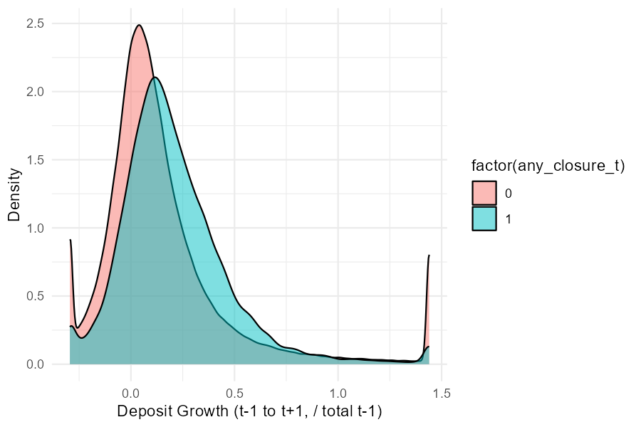
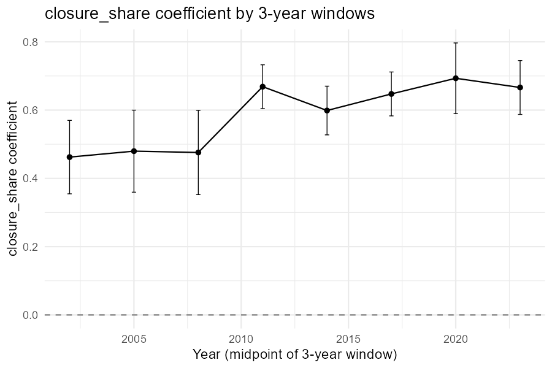
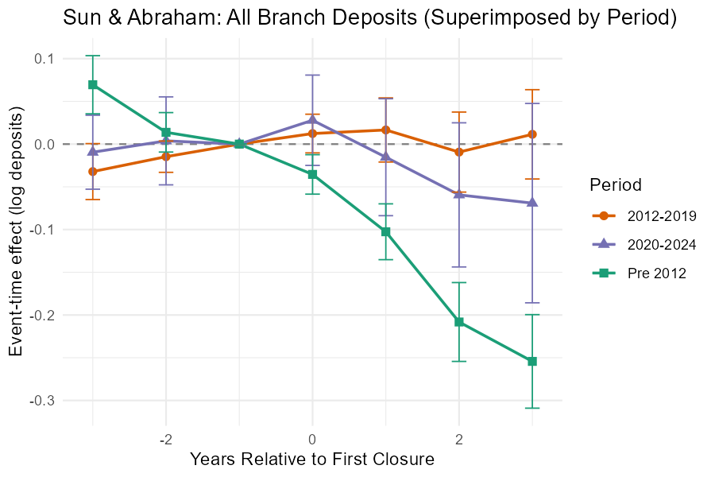
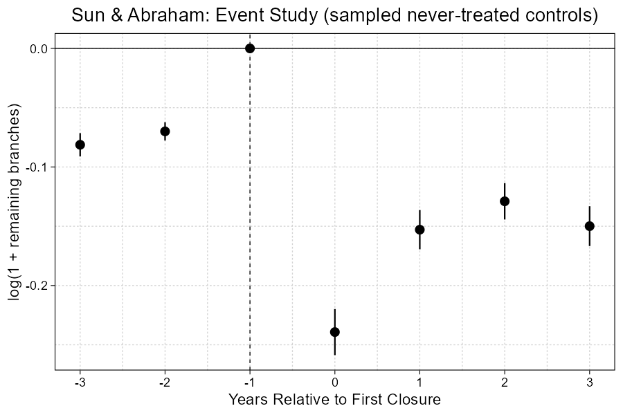

# 1. Branch-Year Panel: Deposit Growth of Surviving Branches

This section summarizes results from the branch-level panel analysis. Results are generated by `app_2010_2019_branch_regression.qmd`. Standard errors are clustered by branch (UNINUMBR) in all regressions.

**Basic idea.** The analysis uses a **branch–year** panel to study how deposit growth at surviving branches relates to the intensity of branch closures in the same county. The focus is on **incumbent** banks (those that did not close branches in that county-year) and on reallocation of deposits from closed branches to surviving branches across banks within a county.

**Unit of observation.** Branch–year. Each observation is a branch that existed at both *t*−1 and *t*+1 (survivors). The main regressor is the county-year share of deposits held by branches that closed, measuring closure exposure in the local market.

**Outcome.** Branch deposit growth (`gr_branch`): change in branch deposits from *t*−1 to *t*+1 divided by *t*−1 deposits.

**Main regressor.** County-year share of deposits held by branches that closed (`share_deps_closed`), i.e., deposits at closed branches as a fraction of total county deposits at *t*−1.

**Sample construction.** Incumbent banks only. Branch-year observations where the branch existed at both *t*−1 and *t*+1. Counties with at least 3 banks (lagged). Years 2012–2024. For each period we report two specifications: branch fixed effects (UNINUMBR + state×year + bank×year) and state×year + bank×year only (no branch FE), so the first column in each pair is within-branch variation.

---

## 1.1 Baseline result

**Regression.** OLS with fixed effects. Dependent variable: branch deposit growth (`gr_branch`). Main regressor: county-year share of deposits at closed branches (`share_deps_closed`). Controls: `log1p(banks_county_lag1)`, `county_dep_growth_t4_t1`, `log1p(dep_lag1_aligned)`, `log_population_density`, `lag_county_deposit_hhi`, `lag_establishment_gr`, `lag_payroll_gr`, `lag_hmda_mtg_amt_gr`, `lag_cra_loan_amount_amt_lt_1m_gr`, `lmi`. Fixed effects: either branch (UNINUMBR) + state×year + bank×year, or state×year + bank×year only. Standard errors clustered by UNINUMBR.

**Sample.** Incumbent banks only. Models 1–2: 2012–2019; Models 3–4: 2020–2024. Within each period, column 1 = branch FE, column 2 = state×year + bank×year.

```
                                    model 1    model 2    model 3    model 4
                                  2012-2019  2012-2019  2020-2024  2020-2024
Dependent Var.:                   gr_branch  gr_branch  gr_branch  gr_branch
                                                                            
share_deps_closed                 0.0752***  0.1298***  0.0121     0.0524** 
                                 (0.0182)   (0.0222)   (0.0203)   (0.0234)  
log1p(banks_county_lag1)         -0.0177*    0.0321*** -0.0585***  0.0236***
                                 (0.0105)   (0.0023)   (0.0159)   (0.0030)  
county_dep_growth_t4_t1           0.0007     0.0041**  -0.0002    -0.0002   
                                 (0.0020)   (0.0021)   (0.0005)   (0.0005)  
log1p(dep_lag1_aligned)          -0.5082*** -0.1133*** -0.6115*** -0.1229***
                                 (0.0062)   (0.0012)   (0.0116)   (0.0017)  
log_population_density            0.0475***  0.0161***  0.0295     0.0111***
                                 (0.0111)   (0.0011)   (0.0250)   (0.0015)  
lag_county_deposit_hhi            0.0138     0.0321***  0.0361    -0.0012   
                                 (0.0237)   (0.0086)   (0.0294)   (0.0106)  
lag_establishment_gr              0.4579***  1.042***  -0.0755     1.008*** 
                                 (0.0697)   (0.0693)   (0.1611)   (0.0962)  
lag_payroll_gr                    0.1102***  0.1924*** -0.2067***  0.0473   
                                 (0.0211)   (0.0237)   (0.0500)   (0.0382)  
lag_hmda_mtg_amt_gr               0.0017    -0.0105     0.0187**   0.0403***
                                 (0.0087)   (0.0101)   (0.0095)   (0.0108)  
lag_cra_loan_amount_amt_lt_1m_gr  0.0072    -0.0034    -0.0108    -0.0133*  
                                 (0.0047)   (0.0057)   (0.0069)   (0.0078)  
lmi                               0.0224*** -0.0195***  0.0236**  -0.0114*  
                                 (0.0076)   (0.0045)   (0.0111)   (0.0061)  
Fixed-Effects:                   ---------- ---------- ---------- ----------
UNINUMBR                                Yes         No        Yes         No
state_yr                                Yes        Yes        Yes        Yes
bank_yr                                 Yes        Yes        Yes        Yes
________________________________ __________ __________ __________ __________
S.E.: Clustered                  by: UNIN.. by: UNIN.. by: UNIN.. by: UNIN..
Observations                        502,944    509,904    262,678    270,672
R2                                  0.66035    0.28202    0.74717    0.34515
Within R2                           0.30334    0.13094    0.35441    0.12660
--- 
Signif. codes: 0 '***' 0.01 '**' 0.05 '*' 0.1 ' ' 1
```


## 1.2 Closure exposure by closer type

**Regression.** Same outcome, controls, and fixed-effect options as in 1.1. Closure exposure is decomposed by the type of the closing bank. For 2012–2019: `share_deps_closed_app` (non–top-4 with app), `share_deps_closed_noapp` (no app), `share_deps_closed_top4`. For 2020–2024: `share_deps_closed_small`, `share_deps_closed_large_but_not_top4`, `share_deps_closed_top4`. Each period shows two columns with branch FE and two with state×year + bank×year only.

**Sample.** Incumbent banks only. Models 1–2: 2012–2019; Models 3–4: 2020–2024.


```
                                                  model 1              model 2               model 3               model 4
                                     2020-2024 (best app) 2020-2024 (best app) 2020-2024 (above med) 2020-2024 (above med)
Dependent Var.:                                 gr_branch            gr_branch             gr_branch             gr_branch
                                                                                                                          
share_deps_closed_app                           0.1035***            0.1490***                                            
                                               (0.0238)             (0.0295)                                              
share_deps_closed_noapp                         0.1618***            0.3114***                                            
                                               (0.0478)             (0.0629)                                              
share_deps_closed_top4                         -0.0065               0.0278               -0.0462               -0.0309   
                                               (0.0336)             (0.0393)              (0.0309)              (0.0377)  
share_deps_closed_large_but_not_top4                                                       0.0790**              0.1205***
                                                                                          (0.0397)              (0.0421)  
share_deps_closed_small                                                                    0.0350                0.1147***
                                                                                          (0.0365)              (0.0404)  
log1p(banks_county_lag1)                       -0.0176*              0.0323***            -0.0582***             0.0238***
                                               (0.0105)             (0.0023)              (0.0159)              (0.0030)  
county_dep_growth_t4_t1                         0.0007               0.0041**             -0.0002               -0.0003   
                                               (0.0020)             (0.0021)              (0.0005)              (0.0005)  
log1p(dep_lag1_aligned)                        -0.5081***           -0.1133***            -0.6115***            -0.1229***
                                               (0.0062)             (0.0012)              (0.0116)              (0.0017)  
log_population_density                          0.0475***            0.0161***             0.0294                0.0111***
                                               (0.0111)             (0.0011)              (0.0250)              (0.0015)  
lag_county_deposit_hhi                          0.0142               0.0329***             0.0369                0.0004   
                                               (0.0237)             (0.0086)              (0.0294)              (0.0106)  
lag_establishment_gr                            0.4576***            1.040***             -0.0745                1.007*** 
                                               (0.0697)             (0.0693)              (0.1611)              (0.0962)  
lag_payroll_gr                                  0.1105***            0.1930***            -0.2051***             0.0477   
                                               (0.0211)             (0.0237)              (0.0500)              (0.0382)  
lag_hmda_mtg_amt_gr                             0.0008              -0.0111                0.0183*               0.0396***
                                               (0.0087)             (0.0101)              (0.0095)              (0.0108)  
lag_cra_loan_amount_amt_lt_1m_gr                0.0071              -0.0034               -0.0109               -0.0134*  
                                               (0.0047)             (0.0057)              (0.0069)              (0.0078)  
lmi                                             0.0222***           -0.0194***             0.0236**             -0.0107*  
                                               (0.0076)             (0.0045)              (0.0111)              (0.0061)  
Fixed-Effects:                                 ----------           ----------            ----------            ----------
UNINUMBR                                              Yes                   No                   Yes                    No
state_yr                                              Yes                  Yes                   Yes                   Yes
bank_yr                                               Yes                  Yes                   Yes                   Yes
____________________________________           __________           __________            __________            __________
S.E.: Clustered                                by: UNIN..           by: UNIN..            by: UNIN..            by: UNIN..
Observations                                      502,944              509,904               262,678               270,672
R2                                                0.66036              0.28205               0.74718               0.34518
Within R2                                         0.30337              0.13098               0.35444               0.12665
--- 
Signif. codes: 0 '***' 0.01 '**' 0.05 '*' 0.1 ' ' 1
```                                                             

**Note.** Model 1 (with branch FE): no significant difference between app and no-app closure effects. Model 2 (without branch FE): significant difference at the 5% level.

## 1.3 Closure exposure × best app / above median app in county (2020–2024)

**Regression.** Same outcome and controls. For 2020–2024, closure exposure by closer size (`share_deps_closed_small`, `share_deps_closed_large_but_not_top4`, `share_deps_closed_top4`) is interacted with (i) whether the incumbent bank has the best app in the county (`best_app_in_county`), or (ii) whether the incumbent is above the median app rating in the county (`above_median_app_in_county`). Columns 1–2: best-app interactions; columns 3–4: above-median interactions. Within each pair: branch FE vs state×year + bank×year.

**Sample.** Incumbent banks only, 2020–2024.


```
                                                                               model 1              model 2               model 3               model 4
                                                                  2020-2024 (best app) 2020-2024 (best app) 2020-2024 (above med) 2020-2024 (above med)
Dependent Var.:                                                              gr_branch            gr_branch             gr_branch             gr_branch
                                                                                                                                                       
best_app_in_county x share_deps_closed_top4                                  0.0441              -0.0961                                               
                                                                            (0.0707)             (0.0711)                                              
share_deps_closed_top4                                                      -0.0507              -0.0213               -0.0949*              -0.0319   
                                                                            (0.0336)             (0.0411)              (0.0555)              (0.0631)  
above_median_app_in_county x share_deps_closed_top4                                                                     0.0838                0.0010   
                                                                                                                       (0.0652)              (0.0774)  
best_app_in_county x share_deps_closed_large_but_not_top4                   -0.0295              -0.0607                                               
                                                                            (0.1090)             (0.1233)                                              
share_deps_closed_large_but_not_top4                                         0.0816*              0.1253***             0.0667                0.0779   
                                                                            (0.0423)             (0.0445)              (0.0623)              (0.0626)  
above_median_app_in_county x share_deps_closed_large_but_not_top4                                                       0.0246                0.0789   
                                                                                                                       (0.0798)              (0.0819)  
share_deps_closed_small x best_app_in_county                                -0.1827*             -0.0041                                               
                                                                            (0.0950)             (0.1064)                                              
share_deps_closed_small                                                      0.0573               0.1140***             0.0395                0.0984*  
                                                                            (0.0398)             (0.0437)              (0.0505)              (0.0575)  
share_deps_closed_small x above_median_app_in_county                                                                   -0.0100                0.0305   
                                                                                                                       (0.0722)              (0.0795)  
best_app_in_county                                                          -0.0048              -0.0143***                                            
                                                                            (0.0051)             (0.0036)                                              
log1p(banks_county_lag1)                                                    -0.0586***            0.0229***            -0.0574***             0.0250***
                                                                            (0.0159)             (0.0030)              (0.0159)              (0.0030)  
county_dep_growth_t4_t1                                                     -0.0002              -0.0003               -0.0002               -0.0003   
                                                                            (0.0005)             (0.0005)              (0.0005)              (0.0005)  
log1p(dep_lag1_aligned)                                                     -0.6115***           -0.1229***            -0.6115***            -0.1228***
                                                                            (0.0116)             (0.0017)              (0.0116)              (0.0017)  
log_population_density                                                       0.0295               0.0108***             0.0292                0.0108***
                                                                            (0.0249)             (0.0015)              (0.0249)              (0.0015)  
lag_county_deposit_hhi                                                       0.0361               0.0037                0.0361                0.0012   
                                                                            (0.0294)             (0.0107)              (0.0294)              (0.0106)  
lag_establishment_gr                                                        -0.0753               1.004***             -0.0726                0.9988***
                                                                            (0.1611)             (0.0962)              (0.1611)              (0.0962)  
lag_payroll_gr                                                              -0.2053***            0.0472               -0.2056***             0.0466   
                                                                            (0.0500)             (0.0382)              (0.0500)              (0.0382)  
lag_hmda_mtg_amt_gr                                                          0.0182*              0.0385***             0.0185*               0.0394***
                                                                            (0.0095)             (0.0108)              (0.0095)              (0.0108)  
lag_cra_loan_amount_amt_lt_1m_gr                                            -0.0108              -0.0127               -0.0109               -0.0132*  
                                                                            (0.0069)             (0.0078)              (0.0069)              (0.0078)  
lmi                                                                          0.0236**            -0.0106*               0.0237**             -0.0104*  
                                                                            (0.0111)             (0.0061)              (0.0111)              (0.0061)  
above_median_app_in_county                                                                                             -0.0080*              -0.0088** 
                                                                                                                       (0.0045)              (0.0035)  
Fixed-Effects:                                                              ----------           ----------            ----------            ----------
UNINUMBR                                                                           Yes                   No                   Yes                    No
state_yr                                                                           Yes                  Yes                   Yes                   Yes
bank_yr                                                                            Yes                  Yes                   Yes                   Yes
________________________________________                                    __________           __________            __________            __________
S.E.: Clustered                                                             by: UNIN..           by: UNIN..            by: UNIN..            by: UNIN..
Observations                                                                   262,678              270,672               262,678               270,672
R2                                                                             0.74719              0.34524               0.74719               0.34521
Within R2                                                                      0.35446              0.12673               0.35447               0.12668
---
Signif. codes: 0 '***' 0.01 '**' 0.05 '*' 0.1 ' ' 1
```                              

## 1.4 Closure exposure × incumbent bank type

**Regression.** Same outcome and controls. `share_deps_closed` is interacted with incumbent bank type: `top4_bank` (top-4 bank) and `large_but_not_top4_bank` (assets > $100B, not top-4). The interaction lets the association between closure exposure and deposit growth vary by incumbent type (top-4, large-but-not-top-4, other). Columns 1–2: 2012–2019; columns 3–4: 2020–2024. Within each period: branch FE vs state×year + bank×year.

**Sample.** Incumbent banks only. Models 1–2: 2012–2019; Models 3–4: 2020–2024.


```
                                               model 1         model 2    model 3        model 4
                                             2012-2019       2012-2019  2020-2024      2020-2024
Dependent Var.:                              gr_branch       gr_branch  gr_branch      gr_branch
                                                                                                
share_deps_closed                            0.0968***       0.1964***  0.0474**       0.0660** 
                                            (0.0232)        (0.0292)   (0.0240)       (0.0306)  
share_deps_closed x top4_bank               -0.1137**       -0.2414*** -0.0949*        0.0039   
                                            (0.0443)        (0.0551)   (0.0499)       (0.0618)  
share_deps_closed x large_but_not_top4_bank -0.0244         -0.1386**  -0.0937*       -0.0579   
                                            (0.0469)        (0.0544)   (0.0561)       (0.0555)  
top4_bank                                    7.541***       -2.844     -0.4509         1.522    
                                            (1.188)    (11,394.1)      (5.312)    (5,223.4)     
large_but_not_top4_bank                     -0.4423          2.257      2.709                   
                                            (1.297)     (3,390.6)      (1.809)                  
log1p(banks_county_lag1)                    -0.0175*         0.0322*** -0.0590***      0.0236***
                                            (0.0105)        (0.0023)   (0.0159)       (0.0030)  
county_dep_growth_t4_t1                      0.0007          0.0041*   -0.0002        -0.0002   
                                            (0.0020)        (0.0021)   (0.0005)       (0.0005)  
log1p(dep_lag1_aligned)                     -0.5082***      -0.1133*** -0.6115***     -0.1229***
                                            (0.0062)        (0.0012)   (0.0116)       (0.0017)  
log_population_density                       0.0476***       0.0160***  0.0294         0.0111***
                                            (0.0111)        (0.0011)   (0.0250)       (0.0015)  
lag_county_deposit_hhi                       0.0132          0.0321***  0.0372        -0.0010   
                                            (0.0237)        (0.0086)   (0.0294)       (0.0107)  
lag_establishment_gr                         0.4580***       1.040***  -0.0761         1.008*** 
                                            (0.0697)        (0.0693)   (0.1611)       (0.0962)  
lag_payroll_gr                               0.1101***       0.1923*** -0.2071***      0.0473   
                                            (0.0211)        (0.0237)   (0.0500)       (0.0382)  
lag_hmda_mtg_amt_gr                          0.0016         -0.0105     0.0186**       0.0403***
                                            (0.0087)        (0.0101)   (0.0095)       (0.0108)  
lag_cra_loan_amount_amt_lt_1m_gr             0.0072         -0.0033    -0.0109        -0.0133*  
                                            (0.0047)        (0.0057)   (0.0069)       (0.0078)  
lmi                                          0.0223***      -0.0196***  0.0238**      -0.0113*  
                                            (0.0076)        (0.0045)   (0.0111)       (0.0061)  
Fixed-Effects:                              ---------- --------------- ---------- --------------
UNINUMBR                                           Yes              No        Yes             No
state_yr                                           Yes             Yes        Yes            Yes
bank_yr                                            Yes             Yes        Yes            Yes
________________________________________    __________ _______________ __________ ______________
S.E.: Clustered                             by: UNIN..    by: UNINUMBR by: UNIN..   by: UNINUMBR
Observations                                   502,944         509,904    262,678        270,672
R2                                             0.66038         0.28206    0.74718        0.34515
Within R2                                      0.30340         0.13099    0.35444        0.12661
---
Signif. codes: 0 '***' 0.01 '**' 0.05 '*' 0.1 ' ' 1
```


# 2. Bank–County Panel: Deposit Retention Through Remaining Branches

This section summarizes results from the bank–county–year panel analysis. Results are generated by `bank_county_year_regression.qmd`. Standard errors are clustered by bank (`bank_id`) in all regressions.

**Basic idea.** The analysis builds a **bank–county–year** panel to study how deposits at **remaining branches** evolve following branch closures. Deposits are observable only through branches; if a bank closes all branches in a county and retains deposits digitally, those deposits do not appear in branch-level data. The analysis is therefore best interpreted as **deposit retention or reallocation through remaining local branches**.

**Unit of observation.** Bank–county–year. For each bank in each county in each year, we aggregate deposits at closed branches (branches that close in year *t* with deposits at *t*−1) and at remaining branches (branches that survive and exist at both *t*−1 and *t*+1).

**Outcome.** Growth of deposits at remaining branches from *t*−1 to *t*+1, normalized by total bank–county deposits at *t*−1: `growth_on_total_t1` = (deps_remain_t+1 − deps_remain_t−1) / total_deps_bank_county_t−1.

**Main regressor.** Share of bank–county deposits that were at branches that closed: `closure_share` = deps_closed_t−1 / total_deps_bank_county_t−1.

**Sample construction.** Base sample: bank–county–years with at least one remaining branch, positive total deposits, and non-missing growth. Growth is winsorized at 5th and 95th percentiles. Main sample: base sample excluding "extreme intensity" observations (closure intensity in the top tail or below 0.01). Fixed effects: bank×year and county×year. Standard errors clustered by bank.

---

## 2.1 Descriptive statistics

**Description.** Mean and standard deviation of the dependent variable (`growth_on_total_t1`) and of `closure_share`, by period (2012–2019 vs 2020–2024) and by whether the bank–county–year had any closure (`any_closure_t` = 0 or 1).


```
|period   |any_closure|N     |deposit_gr_mean|deposit_gr_sd|closure_share_mean|closure_share_sd|
|---------|-----------|------|---------------|-------------|------------------|----------------|
|2012-2019|0          |189817|0.136          |0.287        |0.000             |0.000           |
|2012-2019|1          |  9770|0.208          |0.241        |0.137             |0.125           |
|2020-2024|0          |112972|0.177          |0.330        |0.000             |0.000           |
|2020-2024|1          |  6434|0.276          |0.298        |0.145             |0.127           |
```

**Figure: Deposit growth distribution by closure status.** Kernel density of the dependent variable (growth of deposits at remaining branches from *t*−1 to *t*+1, normalized by total bank–county deposits at *t*−1) in the main sample, separately for bank–county–years with any closure (`any_closure_t` = 1) and with no closure (`any_closure_t` = 0).



## 2.2 Main regressions

**Regression.** OLS with fixed effects. Dependent variable: `growth_on_total_t1` (growth of deposits at remaining branches from *t*−1 to *t*+1, divided by total bank–county deposits at *t*−1). Main regressor: `closure_share` (share of bank–county deposits at closed branches). Control: `log1p(total_deps_bank_county_t1)`. Fixed effects: bank×year and county×year. Standard errors clustered by bank.

**Sample.** Main sample (excludes extreme closure intensity). Model 1: all years; Model 2: pre 2012; Model 3: 2012–2019; Model 4: 2020–2024.


```
                                                All           Pre 2012          2012-2019          2020-2024
Dependent Var.:                  growth_on_total_t1 growth_on_total_t1 growth_on_total_t1 growth_on_total_t1
                                                                                                            
closure_share                             0.6295***          0.5228***          0.6233***          0.6957***
                                         (0.0216)           (0.0291)           (0.0250)           (0.0425)  
log1p(total_deps_bank_county_t1)         -0.1662***         -0.1984***         -0.1424***         -0.1536***
                                         (0.0036)           (0.0048)           (0.0045)           (0.0067)  
log1p(n_remaining_branches)               0.1876***          0.2268***          0.1551***          0.1747***
                                         (0.0060)           (0.0070)           (0.0076)           (0.0081)  
mkt_share_county_t1                       0.3278***          0.3292***          0.3436***          0.3236***
                                         (0.0138)           (0.0220)           (0.0176)           (0.0277)  
Fixed-Effects:                   ------------------ ------------------ ------------------ ------------------
bank_id-YEAR                                    Yes                Yes                Yes                Yes
county-YEAR                                     Yes                Yes                Yes                Yes
________________________________ __________________ __________________ __________________ __________________
S.E.: Clustered                         by: bank_id        by: bank_id        by: bank_id        by: bank_id
Observations                                463,076            179,960            174,551            108,565
R2                                          0.54756            0.60541            0.48829            0.52720
Within R2                                   0.17849            0.23672            0.14464            0.14966
---
Signif. codes: 0 '***' 0.01 '**' 0.05 '*' 0.1 ' ' 1
```

**Figure: closure_share coefficient over time.** Point estimates and 95% confidence intervals from the main regression (closure_share + controls, bank×year and county×year fixed effects, SEs clustered by bank) run separately for each non-overlapping 3-year window in the main sample. The x-axis is the midpoint year of each window.



## 2.3 Main regressions: closure share × demographics (sophisticated, above median age/income)

**Regression.** Same outcome, controls, and fixed effects as in 2.2. `closure_share` is interacted with county-year demographics: `sophisticated` (1 if county-year is above median on education and investment-income share), `above_median_age` (1 if county median age is above year median), and `above_median_income` (1 if county median income is above year median). Allows the association between closure share and deposit growth at remaining branches to vary with local sophistication and age/income.

**Sample.** Main sample. Columns: All years; Pre 2012; 2012–2019; 2020–2024.


```
                                                   All           Pre 2012          2012-2019          2020-2024
Dependent Var.:                     growth_on_total_t1 growth_on_total_t1 growth_on_total_t1 growth_on_total_t1
                                                                                                               
closure_share                                0.7134***          0.7088***          0.7118***          0.6908***
                                            (0.0303)           (0.0498)           (0.0346)           (0.0515)  
closure_share x sophisticated               -0.0064            -0.1367***         -0.0199             0.0527   
                                            (0.0296)           (0.0525)           (0.0386)           (0.0542)  
closure_share x above_median_age             0.0205             0.0473             0.0288            -0.0555   
                                            (0.0272)           (0.0506)           (0.0346)           (0.0588)  
closure_share x above_median_income         -0.1261***         -0.1667***         -0.1199**          -0.0171   
                                            (0.0362)           (0.0604)           (0.0472)           (0.0538)  
log1p(total_deps_bank_county_t1)            -0.1660***         -0.1977***         -0.1424***         -0.1538***
                                            (0.0036)           (0.0048)           (0.0045)           (0.0067)  
log1p(n_remaining_branches)                  0.1867***          0.2249***          0.1551***          0.1743***
                                            (0.0059)           (0.0070)           (0.0075)           (0.0082)  
mkt_share_county_t1                          0.3344***          0.3398***          0.3467***          0.3272***
                                            (0.0134)           (0.0212)           (0.0176)           (0.0277)  
Fixed-Effects:                      ------------------ ------------------ ------------------ ------------------
bank_id-YEAR                                       Yes                Yes                Yes                Yes
county-YEAR                                        Yes                Yes                Yes                Yes
___________________________________ __________________ __________________ __________________ __________________
S.E.: Clustered                            by: bank_id        by: bank_id        by: bank_id        by: bank_id
Observations                                   458,123            177,317            173,135            107,671
R2                                             0.54766            0.60585            0.48850            0.52688
Within R2                                      0.17832            0.23623            0.14498            0.14974
---
Signif. codes: 0 '***' 0.01 '**' 0.05 '*' 0.1 ' ' 1
```

## 2.4 Closure share × app (has app / large good vs bad app)

**Regression.** Same outcome, control, and fixed effects as in 2.2. `closure_share` is interacted with app indicators. Model 1 (2012–2019): interaction with `has_app` (1 if bank has a mobile app). Models 2–4 (2020–2024): interactions with `large_bank_has_app` and `large_bank_no_app`; with `large_good_app` and `large_bad_app` (large bank with app rating above vs at/below year median); and with `large_good_app_cumulative` and `large_bad_app_cumulative`. Allows the association between closure share and deposit growth at remaining branches to vary by whether the bank has an app and by app quality.

**Sample.** Main sample. Model 1: 2012–2019; Models 2–4: 2020–2024.


```
                                          2012-2019: has_app 2020-2024: large.. 2020-2024: yearl.. 2020-2024: cum g..
Dependent Var.:                           growth_on_total_t1 growth_on_total_t1 growth_on_total_t1 growth_on_total_t1
                                                                                                                     
closure_share                                      0.5830***          0.6238***          0.6239***          0.6239***
                                                  (0.0488)           (0.0337)           (0.0337)           (0.0337)  
closure_share x has_app                            0.0503                                                            
                                                  (0.0557)                                                           
closure_share x large_bank_has_app                                    0.1254                                         
                                                                     (0.0818)                                        
closure_share x large_bank_no_app                                     0.1720**                                       
                                                                     (0.0859)                                        
closure_share x large_good_app                                                           0.1061                      
                                                                                        (0.0680)                     
closure_share x large_bad_app                                                            0.1596                      
                                                                                        (0.0978)                     
closure_share x large_good_app_cumulative                                                                   0.0426   
                                                                                                           (0.0915)  
closure_share x large_bad_app_cumulative                                                                    0.1803** 
                                                                                                           (0.0834)  
has_app                                           -0.7605                                                            
                                              (5,772.2)                                                              
log1p(total_deps_bank_county_t1)                  -0.1424***         -0.1535***         -0.1535***         -0.1535***
                                                  (0.0045)           (0.0067)           (0.0067)           (0.0067)  
log1p(n_remaining_branches)                        0.1551***          0.1743***          0.1743***          0.1743***
                                                  (0.0076)           (0.0082)           (0.0082)           (0.0081)  
mkt_share_county_t1                                0.3436***          0.3233***          0.3233***          0.3232***
                                                  (0.0176)           (0.0278)           (0.0278)           (0.0278)  
Fixed-Effects:                            ------------------ ------------------ ------------------ ------------------
bank_id-YEAR                                             Yes                Yes                Yes                Yes
county-YEAR                                              Yes                Yes                Yes                Yes
________________________________________  __________________ __________________ __________________ __________________
S.E.: Clustered                                  by: bank_id        by: bank_id        by: bank_id        by: bank_id
Observations                                         174,551            108,565            108,565            108,565
R2                                                   0.48830            0.52728            0.52728            0.52730
Within R2                                            0.14465            0.14981            0.14981            0.14985
---
Signif. codes: 0 '***' 0.01 '**' 0.05 '*' 0.1 ' ' 1
```

## 2.5 Closure share × drop-in visits / high drop in visits (2020–2024)

**Regression.** Same outcome, control, and fixed effects. `closure_share` is interacted with branch visit measures: Model 1: `drop_in_visits` (continuous); Model 2: `high_drop_visits` (indicator for high drop-in visit intensity). Models 3–4: same as Model 2, split by `large_bank` (assets > $100B vs not). Allows the association between closure share and deposit growth to vary with branch traffic and by bank size.

**Note on `drop_in_visits`.** Total branch visits per bank are summed by year from visit data. `drop_in_visits` = (total visits in 2019 − total visits in 2021) / total visits in 2019 (fractional drop in visits from 2019 to 2021), winsorized at the 1st and 99th percentiles. `high_drop_visits` = 1 if `drop_in_visits` is above the median, 0 otherwise.

**Sample.** Main sample, 2020–2024. Models 1–2: full 2020–2024; Models 3–4: large banks only and small banks only.


```
                                       Drop (cont.)        Drop (high)   High drop: large   High drop: small
Dependent Var.:                  growth_on_total_t1 growth_on_total_t1 growth_on_total_t1 growth_on_total_t1
                                                                                                            
closure_share                             0.5900***          0.5579***          0.4005***          0.5512***
                                         (0.0790)           (0.0596)           (0.1352)           (0.0721)  
closure_share x drop_in_visits            0.2424*                                                           
                                         (0.1472)                                                           
closure_share x high_drop_visits                             0.1569**           0.3866***          0.0726   
                                                            (0.0743)           (0.1111)           (0.0812)  
log1p(total_deps_bank_county_t1)         -0.1524***         -0.1523***         -0.1764***         -0.1503***
                                         (0.0072)           (0.0072)           (0.0305)           (0.0042)  
log1p(n_remaining_branches)               0.1723***          0.1723***          0.1550***          0.1803***
                                         (0.0086)           (0.0086)           (0.0319)           (0.0071)  
mkt_share_county_t1                       0.3284***          0.3284***          0.4921***          0.3148***
                                         (0.0300)           (0.0300)           (0.1584)           (0.0216)  
Fixed-Effects:                   ------------------ ------------------ ------------------ ------------------
bank_id-YEAR                                    Yes                Yes                Yes                Yes
county-YEAR                                     Yes                Yes                Yes                Yes
________________________________ __________________ __________________ __________________ __________________
S.E.: Clustered                         by: bank_id        by: bank_id        by: bank_id        by: bank_id
Observations                                101,275            101,275             20,466             76,987
R2                                          0.52177            0.52179            0.57609            0.55850
Within R2                                   0.14634            0.14638            0.17514            0.14579
---
Signif. codes: 0 '***' 0.01 '**' 0.05 '*' 0.1 ' ' 1
```

## 2.6 Closure share × large bank

**Regression.** Same outcome, control, and fixed effects. `closure_share` is interacted with `large_bank` (1 if bank assets > $100B, 0 otherwise). The interaction allows the association between closure share and deposit growth at remaining branches to vary by bank size.

**Sample.** Model 1: base sample (all years, includes extreme intensity); Model 2: main sample (all years); Models 3–5: main sample by subperiod—pre 2012, 2012–2019, 2020–2024.


```
                                            model 1            model 2            model 3            model 4            model 5
                                               Base               Main           Pre 2012          2012-2019          2020-2024
Dependent Var.:                  growth_on_total_t1 growth_on_total_t1 growth_on_total_t1 growth_on_total_t1 growth_on_total_t1
                                                                                                                               
closure_share                             0.3720***          0.4361***          0.3591***          0.4350***          0.5176***
                                         (0.0140)           (0.0159)           (0.0319)           (0.0230)           (0.0276)  
closure_share x large_bank                0.2415***          0.2446***          0.2197***          0.2483***          0.1947***
                                         (0.0278)           (0.0295)           (0.0567)           (0.0332)           (0.0669)  
large_bank                               -1.233             -0.6423            -0.6855             1.124                       
                                       (303.2)            (498.5)            (353.0)          (3,676.7)                        
log1p(total_deps_bank_county_t1)         -0.0565***         -0.0577***         -0.0696***         -0.0483***         -0.0523***
                                         (0.0014)           (0.0014)           (0.0019)           (0.0015)           (0.0028)  
Fixed-Effects:                   ------------------ ------------------ ------------------ ------------------ ------------------
bank_id-YEAR                                    Yes                Yes                Yes                Yes                Yes
county-YEAR                                     Yes                Yes                Yes                Yes                Yes
________________________________ __________________ __________________ __________________ __________________ __________________
S.E.: Clustered                         by: bank_id        by: bank_id        by: bank_id        by: bank_id        by: bank_id
Observations                                497,040            492,521            198,644            181,868            112,009
R2                                          0.52614            0.52887            0.56546            0.47391            0.53530
Within R2                                   0.10785            0.10620            0.14011            0.08518            0.09006
---
Signif. codes: 0 '***' 0.01 '**' 0.05 '*' 0.1 ' ' 1

```


# 3 Event Studies

## 3.1 Total deposits at bank-county-year (all observed branches)

**Method.** Sun and Abraham (2021)–style event study. Outcome: log(1 + total deposits) at the bank–county–year level, where total deposits are the sum of deposits across all observed branches of the bank in that county and year (including branches that will close or have closed). Treatment is the first year in which the bank has any branch closure in that county (“cohort” = first closure year). Specification: `log1p(total_deps_all_branches) ~ sunab(cohort, YEAR, ref.p = -1) | unit_id + YEAR`, with standard errors clustered by bank. The event-time coefficients are normalized to zero at *t* = −1 (year before first closure).

**Sample.** Bank–county–years are included if: (i) the bank–county is ever treated (has at least one closure), and the year is within [cohort − 3, cohort + 3]; or (ii) the bank–county is never treated, and it is in a 50% random sample of never-treated bank–counties (same never-treated units used across years). Never-treated units are assigned cohort = 10000 for the sunab implementation. The analysis is run separately for three periods: Pre 2012; 2012–2019; and 2020–2024. The figure superimposes the event-time coefficients from these three regressions (with 95% confidence intervals) in a single plot.




## 3.2 Deposits at surviving branches only (consistent branch set)

**Method.** Sun and Abraham (2021)–style event study with a **consistent branch set**: the outcome is log(1 + deposits) at the bank–county–year level counting only deposits at branches that do **not** close in the cohort year. For each treated bank–county, branches that close in the first-closure year are identified and excluded from the deposit series in all years, so the same set of “surviving” branches is used before and after the event. This removes the mechanical drop in total deposits that would otherwise come from closing branches. Specification: `log1p(deps_consistent) ~ sunab(cohort, YEAR, ref.p = -1) | unit_id + YEAR`, with standard errors clustered by bank. Event-time coefficients are normalized to zero at *t* = −1.

**Sample.** Same as in 3.1: treated bank–counties in [cohort − 3, cohort + 3]; never-treated from a random sample (share set by `params$never_treated_share`); cohort = 10000 for never-treated. The analysis is run separately for Pre 2012, 2012–2019, and 2020–2024. The figure superimposes the event-time coefficients from these three regressions (with 95% confidence intervals).


## 3.3 Robustness: Number of remaining branches 

**Purpose.** As a robustness check, the same Sun and Abraham setup is applied to the **number of remaining branches** at the bank–county–year level. If branch closures are concentrated at the event year (no systematic pre-trend in branch counts), the event-time coefficients for log(1 + n_remaining_branches) should be close to zero before *t* = 0 and move only at *t* = 0 when closures occur.

**Method.** Outcome: log(1 + n_remaining_branches). Same cohort definition (first closure year), same sample (treated in [cohort − 3, cohort + 3], sampled never-treated), and same specification: `log1p(n_remaining_branches) ~ sunab(cohort, YEAR, ref.p = -1) | unit_id + YEAR`, SEs clustered by bank. Single regression over all years (no period split).

**Interpretation.** The figure shows that the number of remaining branches is essentially flat before the event and drops at *t* = 0, consistent with closures occurring at the event year.


